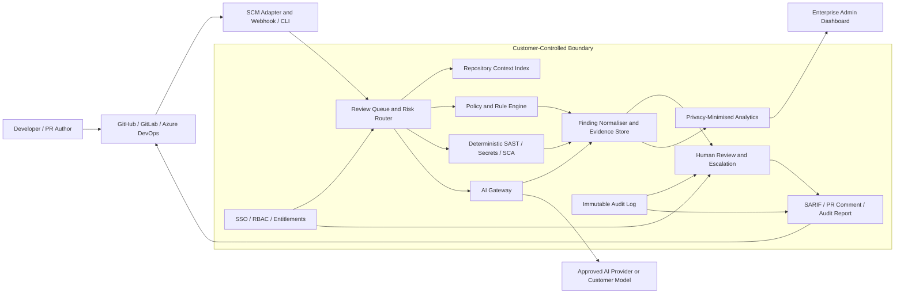

# AI-Code-Reviewer Enterprise — Target Architecture and Execution Roadmap

**Author:** Manus AI  
**Date:** 14 August 2026  
**Scope:** Product, platform and operations roadmap. The target architecture is a design direction, not a statement that every component is implemented today.

---

## 1. Architecture Principle

AI-Code-Reviewer must evolve from a single-process desktop reviewer into a **local-first enterprise review platform**. The product should keep source-code analysis, policy evaluation and sensitive review context within a customer-controlled boundary wherever possible. It may use approved AI providers through a controlled gateway, but must maintain deterministic fallback, model/prompt provenance, data minimisation and human decision authority.

The architecture supports three deployment modes without rebuilding the product per market:

| Mode | Customer profile | Data boundary | Commercial tier |
|---|---|---|---|
| Desktop / Local | Individual and small team | User workstation | Community / Team |
| Customer VPC | Mid-market and regulated customers | Customer cloud account | Enterprise |
| Air-gapped / On-premises | Defence, public sector, highly regulated | Customer datacentre | Enterprise+ |

> **Design rule:** The product may automate analysis and remediation proposals, but no unreviewed AI output can approve, merge or deploy customer code.

---

## 2. Target Component Architecture

The current product already contains useful foundations: a PySide6 desktop UI, CLI entry point, JSON-only local rule packs, local SAST, SARIF output, a SQLite findings trend, and a local-first design. The next architecture should preserve these properties while separating responsibilities that currently sit largely in `core/ai_engine.py`.

---

## 3. Target Services and Responsibilities

| Component | Responsibilities | Current state | Required evolution |
|---|---|---|---|
| SCM adapter | GitHub/GitLab/Azure DevOps authentication, PR events, comments, status checks | GitHub client and CLI flow | Add provider adapter interface; OAuth/GitHub App option; webhook verification; idempotent delivery handling |
| Review queue and router | Determine review depth and priority by repo, path, risk and budget | Not implemented | Persisted queue, retry policy, quota, risk rules, draft/generated-file exclusions |
| Context index | Build dependency and ownership context | Python-only import/function extraction | Language-server / parser-backed index; repository graph; explicit context exclusions |
| Deterministic analysis | SAST, secrets, policy rules, SCA | Basic local SAST and regex JSON rule packs | Semgrep-compatible or tree-sitter rules; dependency inventory; SBOM; baseline management |
| AI gateway | Approved model routing, prompt templates, redaction, cost/budget control | Direct model SDK call | Provider abstraction; model registry; prompt/version registry; redaction; strict data egress policy; local model option |
| Finding normaliser | Deduplicate, rank, source-label and explain findings | Basic normalisation and SARIF export | Confidence/calibration, evidence links, reason codes, feedback-loop learning and suppression governance |
| Identity and access | SSO, SCIM, roles, entitlements | Early license manager placeholder | OIDC/SAML, SCIM, roles, tenant and repository scopes, signed entitlements |
| Audit and evidence | Who ran, changed, approved or suppressed a review | Local review history only | Append-only audit log; retention policy; export for auditors |
| Analytics | Opt-in product telemetry and privacy-minimised metrics | Local telemetry placeholder | Consent manager, event schema, no-code telemetry policy, retention and deletion controls |
| Admin and reporting | Policy lifecycle, budgets, compliance reporting | Desktop trend screen | Web or desktop admin console; multi-repo dashboard; policy assignment; exportable evidence |

---

## 4. Non-Negotiable Trust Controls

The product must not market an enterprise posture until the following controls are implemented and verified:

| Control | Acceptance criterion |
|---|---|
| Data egress policy | Every route that can transmit source code is documented, configurable and tested. Customers can disable external model calls. |
| AI provenance | Every AI-assisted finding records model/provider identifier, model version, prompt/rule version, timestamp, confidence and retained-evidence policy. |
| Deterministic fallback | Local policy/SAST results remain available if the AI provider is unavailable or blocked. |
| Policy governance | Rule packs are signed/versioned, validated, scoped to repositories, reviewable and revertible. |
| Secret handling | Credentials are stored through OS keychain or approved secret store; no token is hardcoded, logged or retained in telemetry. |
| Consent-driven telemetry | Opt-in by default for non-essential telemetry; schema prohibits code, snippets, secrets, repository names and personal data unless explicitly authorised. |
| Human approval | AI actions can create a suggested patch or draft PR but cannot merge protected branches. |
| Auditability | Review, policy change, suppression, entitlement and admin actions are exportable with immutable timestamps. |

NIST SP 800-218A supports applying secure-development practices across AI model/system development and acquisition; the controls above operationalise that direction for this product. [1]

---

## 5. Phased Product Roadmap

### Phase 0 — Stabilise the foundation (0–30 days)

The objective is to make the existing prototype credible as a controlled beta rather than add broad features.

| Priority | Deliverable | Exit criteria |
|---|---|---|
| P0 | Remove token defaults and use OS credential storage | No secrets in source, config, logs or telemetry; automated secret scan passes |
| P0 | Correct licensing implementation | Signed, offline-verifiable license token with expiry, feature entitlements and revocation-ready design |
| P0 | Replace local telemetry placeholder | Explicit consent, local event buffer, no-code schema and visible disable/export/delete controls |
| P0 | Add automated quality gates | Unit/integration tests, static checks, SBOM, dependency updates, reproducible Windows build |
| P0 | Publish AI System Card and privacy/data-flow documentation | Approved customer-facing documents; all model/data paths described |
| P1 | Improve current review schema | Each finding has origin, confidence band, rule ID, evidence and reviewer-status fields |

### Phase 1 — Enterprise pilot readiness (31–90 days)

The objective is to secure three design partners and generate evidence of ROI.

| Priority | Deliverable | Exit criteria |
|---|---|---|
| P0 | GitHub App / OAuth integration | Least-privilege scopes, installation flow, webhook signature verification and audit trail |
| P0 | Policy control plane | Versioned rule-pack repository, approval workflow, scope controls and baseline/suppression policy |
| P0 | Review queue and risk routing | WIP/draft/generated-file exclusions, risk-based deep review and visible budget consumption |
| P1 | Evidence and audit export | SARIF plus CSV/JSON/PDF evidence export; suppression and policy-change logs |
| P1 | Design-partner pilot program | Three signed design partners; mutually agreed success metrics and weekly feedback cadence |
| P1 | Security baseline | Threat model, vulnerability disclosure process, penetration-test plan and security questionnaire |

### Phase 2 — Commercial launch (91–180 days)

The objective is to convert pilots into annual recurring revenue and publish a sellable product.

| Priority | Deliverable | Exit criteria |
|---|---|---|
| P0 | Team and Enterprise editions | Entitlements, per-tenant configuration, annual contract flow, support escalation policy |
| P0 | SSO/RBAC/audit logging | OIDC/SAML, least-privilege roles, immutable admin events |
| P0 | VPC deployment package | Infrastructure-as-code reference, operating guide, backup/upgrade strategy and customer test environment |
| P1 | Context indexing v1 | Multi-language dependency graph; repository-aware review with explicit privacy boundaries |
| P1 | Enterprise reporting | Executive dashboard, compliance evidence pack, MTTR and finding-trend metrics |
| P2 | GitHub Marketplace and partner materials | Listing, security brief, case-study template and partner playbook |

### Phase 3 — Platform expansion (6–12 months)

The objective is to build defensible multi-platform value and reduce reliance on a single source-control provider.

| Priority | Deliverable | Exit criteria |
|---|---|---|
| P0 | GitLab and Azure DevOps adapters | Equivalent PR/MR review, status and audit workflow |
| P0 | SCA/SBOM and dependency exploitability | Supported ecosystems, evidence-backed vulnerability triage and remediation workflow |
| P1 | Model orchestration | Approved provider / customer model selection, evaluation harness and model rollback |
| P1 | Multi-repository portfolio dashboard | Organisation-wide policy posture, trends and review budgets |
| P1 | SIEM / ticketing integrations | Jira, ServiceNow and Splunk/Sentinel integration with least-privilege access |

### Phase 4 — Global scale and certification (12–24 months)

The objective is to support repeatable regional expansion and become procurement-ready for larger enterprises.

| Priority | Deliverable | Exit criteria |
|---|---|---|
| P0 | SOC 2 Type II programme | Audit-ready controls and completed attestation target |
| P0 | GDPR commercial readiness | DPA, subprocessors list, data-residency options, DSAR process and retention controls |
| P1 | ISO 27001 programme | ISMS scope, risk register and certification roadmap |
| P1 | Localisation framework | Translation management, locale-aware format/currency, regional billing without product rebuild |
| P1 | Partner and reseller programme | Training, margin model, deal registration and co-sell playbook |

---

## 6. Product Metrics and Operating Cadence

The product is successful only if it produces trusted action, not more comments.

| Metric | Definition | 90-day target | 12-month target |
|---|---|---|---|
| Precision proxy | % of AI findings accepted, fixed or marked useful by reviewers | ≥40% in pilots | ≥60% |
| Review coverage | % of eligible PRs reviewed automatically or on request | ≥50% | ≥80% |
| Time to first value | Median time from install to first completed review | <10 minutes | <5 minutes |
| Reviewer action rate | % of findings with a disposition | ≥50% | ≥75% |
| False-positive rate | % of dismissed findings without change | Baseline + reduce 20% | <20% |
| Pilot conversion | Design partners converting to paid annual agreement | ≥1 of 3 | ≥50% of qualified pilots |
| Net revenue retention | Expansion and churn among paid accounts | N/A | >110% |

All metrics require explicit definitions, a consistent data-collection policy and customer consent where telemetry is used. They must not be measured by collecting source code or secrets.

---

## 7. Decision Gates

| Gate | Decision | Evidence required |
|---|---|---|
| G1: after Phase 0 | Proceed to design-partner pilots? | Security baseline, working entitlement/telemetry controls, no P0 defects, reproducible build |
| G2: after Phase 1 | Launch paid Enterprise tier? | At least one pilot shows measurable review-time or signal-quality improvement; security review passed; support readiness confirmed |
| G3: after Phase 2 | Expand beyond GitHub? | Repeatable onboarding, positive gross-margin estimate, 3+ paying customers, strong feature demand |
| G4: after Phase 3 | Enter new region/certification investment? | Pipeline density, partner readiness, legal/data-residency gap assessment and forecasted payback |

---

## References

[1]: https://www.nist.gov/publications/secure-software-development-practices-generative-ai-and-dual-use-foundation-models-ssdf "NIST SP 800-218A — Secure Software Development Practices for Generative AI and Dual-Use Foundation Models"

---
**Prepared by Manus AI**
