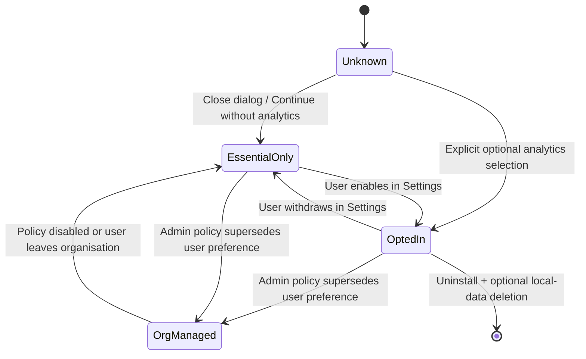

# طراحی جریان Telemetry Opt-in برای GDPR و حریم خصوصی Enterprise

> **یادداشت حقوقی:** من وکیل نیستم؛ این سند یک طراحی فنی/عملیاتی است، نه مشاورهٔ حقوقی رسمی. پیش از اتکا به آن برای عرضه در اتحادیهٔ اروپا، مبنای قانونی، نقش‌های controller/processor، DPA، انتقال بین‌المللی داده و notice نهایی باید توسط counsel متخصص privacy بازبینی شود.

**نویسنده:** Manus AI  
**تاریخ:** ۱۴ اوت ۲۰۲۶  
**وضعیت:** طراحی پیشنهادی برای پیاده‌سازی. این سند تأیید نمی‌کند که محصول هم‌اکنون GDPR-compliant است.

---

## خلاصهٔ مدیریتی

Telemetry تنها زمانی برای محصول ارزشمند است که **کمینه، قابل‌فهم، قابل‌کنترل و قابل‌اثبات** باشد. طراحی پیشنهادی telemetry را به دو جریان مستقل تبدیل می‌کند: رویدادهای عملیاتی ضروری که برای اجرای سرویس قراردادی یا امنیت لازم هستند، و product analytics اختیاری که برای بهبود محصول استفاده می‌شوند. این دو جریان نباید در یک toggle یا یک notice مبهم ادغام شوند.

برای product analytics اختیاری، UI باید پیش از هر upload یک انتخاب صریح ارائه کند: **«ارسال analytics اختیاری»** یا **«ادامه بدون analytics»**. انتخاب پیش‌فرض Off است؛ رد کردن یا بستن پنجره معادل عدم رضایت است؛ و استفاده از review محلی و قابلیت‌های اصلی نباید به پذیرش analytics مشروط شود. EDPB به‌طور رسمی Guidelines 05/2020 دربارهٔ consent منتشر کرده است و ICO راهنمای خود را حول شرایط رضایت معتبر، ثبت/مدیریت consent و حق withdrawal سازمان‌دهی می‌کند. [1] [2]

---

## ۱. طبقه‌بندی داده و مبنای پردازش

### ۱.۱ دو جریان دادهٔ جدا

| جریان | هدف | مثال دادهٔ مجاز | پیش‌فرض | نیاز به consent product analytics |
|---|---|---|---|---|
| Service/Security Essential | راه‌اندازی entitlement، جلوگیری از تقلب، دریافت update امنیتی یا اجرای پردازش قراردادی ضروری | `license_id` pseudonymous، version، signing verification outcome، security update availability | مطابق قرارداد/deployment | نه لزوماً؛ مبنای قانونی باید جداگانه توسط counsel تعیین شود |
| Optional Product Analytics | بهبود UX، اولویت‌گذاری bug، اندازه‌گیری adoption feature | app version، OS major version، feature flag، duration bucket، result bucket | Off | بله، مگر مبنای قانونی دیگری به‌طور معتبر و شفاف تعیین شود |
| Support Diagnostics | حل یک ticket مشخص | diagnostics scrubbed و انتخاب‌شده توسط کاربر | Off | upload جداگانه و per-ticket؛ رضایت/دستور صریح کاربر لازم است |

«ضروری» نباید بهانه‌ای برای جمع‌آوری گسترده باشد. اگر یک field صرفاً برای roadmap یا تجربهٔ کاربر مفید است، باید در optional analytics قرار گیرد. هیچ source code، code snippet، diff، repository URL/ID، filename/path، PR title، raw exception، email، IP address، token، credential یا free-text field در product analytics مجاز نیست.

### ۱.۲ نقش‌های Enterprise

در نسخهٔ Enterprise باید telemetry policy در سطح tenant تعریف شود. مشتری سازمانی ممکن است controller دادهٔ کارکنان باشد و vendor ممکن است processor یا controller مستقل برای داده‌های محدود محصول باشد؛ این موضوع قراردادی و وابسته به processing واقعی است و قابل فرض نیست. بنابراین محصول باید از لحاظ فنی هر دو سناریو را پشتیبانی کند.

| حالت deployment | سیاست پیش‌فرض پیشنهادی | کنترل کننده |
|---|---|---|
| Community/Desktop | Optional analytics Off؛ user انتخاب می‌کند | کاربر نهایی، مشروط به notice و نقش حقوقی واقعی |
| Team/Business managed | Organization policy تعیین می‌کند؛ کاربر UI شفاف می‌بیند | Admin + privacy governance مشتری |
| Enterprise VPC/on-prem | Vendor product analytics Off؛ تنها telemetry محلی/مشتری یا explicit support bundle | Customer administrator |
| Support incident | Export/upload انتخابی و محدود به ticket | کاربر/admin مجاز |

---

## ۲. تجربهٔ کاربری رضایت

### ۲.۱ زمان و شکل نمایش

پنجرهٔ consent در اولین launch پس از نصب/upgrade مهم نمایش داده می‌شود، اما فقط پس از آن‌که کاربر بتواند product را بدون analytics نیز اجرا کند. کاربر نباید برای ادامه مجبور به انتخاب «Yes» شود. در deployment سازمانی، policy admin قبل از نمایش اعمال می‌شود و UI واضحاً می‌گوید که analytics بر اساس policy سازمان فعال یا غیرفعال است.

```text
به بهبود AI-Code-Reviewer کمک کنید

اگر انتخاب کنید، داده‌های فنیِ حداقلی و بدون کد منبع را برای بهبود محصول ارسال می‌کنیم.
ما هرگز source code، diff، نام/نشانی repository، PR، مسیر فایل، token، کلید API یا متن خطا را در analytics جمع‌آوری نمی‌کنیم.

چه چیزی ارسال می‌شود؟
• نسخهٔ برنامه، نسخهٔ عمدهٔ ویندوز و نوع feature استفاده‌شده
• زمان اجرای review به‌صورت بازه‌ای و نتیجهٔ کلی به‌صورت bucket
• وضعیت موفق/ناموفقِ بدون متن خطا یا شناسهٔ پروژه

هدف: سنجش پایداری و اولویت‌بندی بهبودهای محصول
مدت نگهداری: ۳۰ روز در صف محلی؛ ۹۰ روز در سرویس analytics (پیشنهادی، قابل تنظیم)
گیرنده/محل پردازش: <vendor / region / DPA link>

[ادامه بدون analytics]     [ارسال analytics اختیاری]

هر زمان از Settings می‌توانید انتخاب خود را تغییر دهید.
[Privacy Notice] [جزئیات داده‌ها]
```

دو دکمه باید از نظر رنگ، اندازه و جایگاه برابر باشند. هیچ checkbox پیش‌تیک‌شده، countdown، wording سرزنش‌گر، یا کاهش قابلیت local review بعد از رد انتخاب نباید وجود داشته باشد.

### ۲.۲ state machine رضایت



رفتار withdrawal باید فوری باشد: upload اختیاری متوقف شود، صف local analytics حذف شود و receipt جدید با تصمیم `withdrawn` ثبت شود. داده‌هایی که قبلاً قانونی و با consent منتقل شده‌اند، باید بر اساس retention policy و درخواست‌های deletion رسیدگی شوند؛ این behavior باید در privacy notice و DPA مشخص باشد.

---

## ۳. Consent Receipt و Auditability

برای اثبات choice، محصول فقط حداقل evidence لازم را ثبت می‌کند. receipt یک سند privacy audit است، نه telemetry event.

```json
{
  "receipt_schema": 1,
  "receipt_id": "local-uuid",
  "purpose_ids": ["optional_product_analytics"],
  "decision": "opted_in",
  "policy_version": "privacy-2026-08",
  "notice_locale": "en-US",
  "recorded_at": "2026-08-14T12:00:00Z",
  "source": "user_settings",
  "tenant_policy_id": null,
  "app_version": "1.2.0"
}
```

| Field | چرا لازم است | چه چیزی نیست |
|---|---|---|
| `purpose_ids` | اثبات specific consent | یک toggle مبهم برای همهٔ processingها |
| `policy_version` | مشخص‌کردن notice دیده‌شده | متن کامل privacy notice در هر event |
| `decision` و `recorded_at` | اثبات زمان انتخاب/withdrawal | پروفایل رفتار یا user tracking |
| `source` | تفکیک user choice از admin policy | identity شخصی مگر واقعاً ضروری و مستند |
| `tenant_policy_id` | audit سازمانی در Enterprise | نام repository یا کد منبع |

receipt باید در application data محلی نگهداری شود و، در Enterprise managed، به audit service سازمانی export شود؛ نه در analytics stream. Receipt retention باید به نیاز اثبات consent محدود و زمان‌بندی‌اش در retention schedule مشخص باشد.

---

## ۴. Telemetry Schema و Data-Loss Prevention

### ۴.۱ allowlist سخت‌گیرانه

هر event پیش از queue شدن توسط schema validator بررسی می‌شود. هر key خارج از allowlist rejection ثبت می‌کند و payload drop می‌شود. هیچ API نباید `log_event(type, arbitrary_dict)` یا معادل آن داشته باشد.

| Field مجاز | Type | مثال | محدودیت |
|---|---|---|---|
| `event_name` | enum | `review_completed` | فقط enum از پیش تعیین‌شده |
| `app_version` | string | `1.2.0` | max 32 chars |
| `os_major` | enum | `windows_11` | بدون build/device ID |
| `license_tier` | enum | `team` | بدون license ID |
| `review_mode` | enum | `local_sast`, `ai_standard` | بدون repo/project context |
| `duration_bucket_ms` | enum | `1000_4999` | bucket؛ بدون timestamp دقیق per action |
| `result_bucket` | enum | `success`, `provider_unavailable` | بدون exception text |
| `finding_count_bucket` | enum | `0`, `1_5`, `6_20`, `21_plus` | بدون rule description/path |
| `consent_state` | enum | `opted_in` | فقط برای integrity flow |

### ۴.۲ rejection rules

validator باید event را رد کند اگر payload شامل URL، hostname، path separator، source-like multiline text، token/secret regex، email address، UUID غیرمجاز، raw exception یا field ناشناخته باشد. Test suite باید نمونه‌های GitHub PAT، OpenAI key، SSH key، JWT، repository URL، Windows path و Python stack trace را به‌عنوان negative test داشته باشد.

### ۴.۳ queue و transport

صف اختیاری در `%LOCALAPPDATA%\\AI-Code-Reviewer\\telemetry\\queue.db` یا JSONL کوچک نگهداری می‌شود؛ size cap و TTL دارد و با withdrawal فوراً purge می‌شود. در صورت وجود metadata حساس تجاری، صف با DPAPI CurrentUser رمز می‌شود؛ اما رمزنگاری جای minimisation را نمی‌گیرد. Transport فقط HTTPS به endpoint allowlisted است؛ certificate validation، connect/read timeout، retry with backoff و event batch size ثابت لازم است. endpoint نباید query parameter حاوی identity یا repository داشته باشد.

---

## ۵. مدل کنترل Enterprise

### ۵.۱ اولویت policy

| سطح | مثال تصمیم | اولویت |
|---|---|---:|
| قانون/قرارداد deployment | VPC/on-prem: vendor analytics prohibited | ۱ |
| Tenant admin policy | Optional analytics disabled organisation-wide | ۲ |
| User preference | User opt-in در desktop مستقل | ۳ |
| Product default | Optional analytics Off | ۴ |

اگر policy سازمانی analytics را خاموش می‌کند، user نمی‌تواند آن را روشن کند. اگر policy سازمانی analytics را روشن اعلام می‌کند، UI باید category، purpose، legal notice و contact DPO/privacy team مشتری را نمایش دهد؛ محصول نباید چنین policy را به نام “user consent” ثبت کند. Admin policy و user consent مفاهیم جداگانه‌اند.

### ۵.۲ Privacy controls برای procurement

| کنترل | Artifact مورد انتظار |
|---|---|
| Data map | فهرست fieldها، مقصد، retention، subprocessor و transfer region |
| DPA | نقش‌ها، instruction، security measures، subprocessors، DSAR/incident clauses |
| Retention | TTL queue محلی، retention server-side، deletion workflow و backup policy |
| DSAR / deletion | owner، intake channel، identity verification و response procedure |
| Security | encryption in transit، access control، logging، incident response و vulnerability disclosure |
| Change management | approval برای schema/purpose جدید و re-consent در صورت material change |

---

## ۶. Material change و Re-consent

اگر category داده، purpose، recipient، region، retention یا نوع processing به‌شکل مادی تغییر کند، optional analytics متوقف و consent دوباره درخواست می‌شود. تنها افزایش نسخهٔ برنامه یا تغییر cosmetic notice نیاز به re-consent ندارد. privacy review باید schema pull request را مانند API change بررسی کند و هر event جدید نیازمند purpose، owner، field inventory، retention و test DLP باشد.

---

## ۷. معیار پذیرش فنی و UX

| Test | معیار موفقیت |
|---|---|
| First run | بدون click صریح، هیچ analytics event در queue یا network دیده نمی‌شود |
| Reject path | انتخاب «ادامه بدون analytics» همهٔ قابلیت‌های local review را حفظ می‌کند |
| Opt-in path | receipt صحیح ایجاد می‌شود و فقط eventهای allowlisted queue می‌شوند |
| Withdraw path | upload فوراً متوقف، queue اختیاری حذف و receipt `withdrawn` ثبت می‌شود |
| Enterprise policy | policy admin بر user preference پیشی می‌گیرد و UI وضعیت managed را شفاف نشان می‌دهد |
| DLP | code, token, URL, path, email, exception و unknown field رد می‌شوند |
| Material change | تغییر purpose/recipient/region، analytics را تا re-consent متوقف می‌کند |
| Diagnostics | upload فقط با action جداگانه و ticket-bound انجام می‌شود؛ قبل از upload scrub/test می‌شود |

---

## منابع

[1]: https://www.edpb.europa.eu/documents/guideline/guidelines-052020-on-consent-under-regulation-2016679_en "EDPB — Guidelines 05/2020 on consent under Regulation 2016/679"
[2]: https://ico.org.uk/for-organisations/uk-gdpr-guidance-and-resources/lawful-basis/consent/ "ICO — Consent"

---

## افشا و حدود

**مبنا:** طراحی از اصول consent، minimisation، transparency و withdrawal در منابع رسمی فوق و معماری محلی محصول استخراج شده است.  
**زمان:** منابع در ۱۴ اوت ۲۰۲۶ بررسی شده‌اند.  
**فرض‌ها:** product analytics غیرضروری است و source code/customer data در آن مجاز نیست.  
**منابع و اطمینان:** اصول UX/فنی با منابع EDPB/ICO هم‌راستا هستند؛ نقش‌های controller/processor و lawful basis نهایی باید برای هر deployment توسط counsel تعیین شوند.  
**انطباق:** این سند گواهی GDPR compliance یا مشاورهٔ حقوقی نیست.

---
**Prepared by Manus AI**
