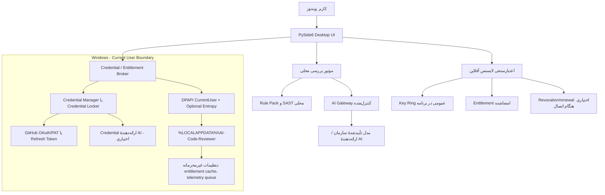

# طراحی امنیت ویندوز، Keychain و لایسنسینگ Enterprise برای AI-Code-Reviewer

**نویسنده:** Manus AI  
**تاریخ:** ۱۴ اوت ۲۰۲۶  
**وضعیت:** طراحی پیشنهادی برای اجرا؛ این سند بیان نمی‌کند که کنترل‌های مذکور هم‌اکنون در محصول پیاده‌سازی شده‌اند.

---

## خلاصهٔ مدیریتی

نسخهٔ فعلی برنامه برای ارزیابی و نمایش توکن، لایسنس و تله‌متری یک نمونهٔ اولیه است؛ نه یک پیاده‌سازی آمادهٔ Enterprise. توکن GitHub فقط در حافظهٔ فرایند نگه داشته می‌شود، اعتبارسنجی لایسنس صرفاً بر پیشوند یک رشته متکی است و تله‌متری به شکل پیش‌فرض در فایلی با مسیر لینوکسی ثبت می‌شود. این سه موضوع باید پیش از هر پایلوت سازمانی اصلاح شوند.

معماری پیشنهادی از سه اصل پیروی می‌کند: **اسرار هرگز در فایل تنظیمات، SQLite یا لاگ ثبت نشوند؛ لایسنس با امضای نامتقارن و بدون کلید خصوصی در کلاینت قابل اعتبارسنجی باشد؛ و تله‌متری پیش از امنیت، با حداقل‌سازی داده و رضایت آگاهانه طراحی شود.** در ویندوز، Credential Locker / Credential Manager محل نگهداری credential کوچک است و DPAPI برای رمزکردن blobهای تنظیمات غیرمحرمانه اما حساس با محدودهٔ کاربر به کار می‌رود. Microsoft تصریح می‌کند که DPAPI معمولاً فقط برای همان کاربر و همان دستگاه قابل رمزگشایی است و `CRYPTPROTECT_LOCAL_MACHINE` دسترسی را به همهٔ کاربران همان دستگاه گسترش می‌دهد؛ این گزینه برای PAT کاربر نباید استفاده شود. [1]

---

## ۱. مدل تهدید نسخهٔ دسکتاپ ویندوز

این برنامه با چهار دسته داده کار می‌کند: توکن‌های GitHub یا GitHub App، کلید یا credential ارائه‌دهندهٔ AI، entitlement لایسنس و متادیتای محلی بررسی/تله‌متری. بزرگ‌ترین تهدیدها عبارت‌اند از سرقت توکن از فایل و لاگ، نشت credential از command line، جعل لایسنس، دست‌کاری تنظیمات، ارسال ناخواستهٔ کد یا اسرار در تله‌متری، و انتشار یک installer جعلی یا تغییرکرده.

| دارایی | تهدید اصلی | کنترل لازم | تصمیم طراحی |
|---|---|---|---|
| GitHub credential | استخراج از دیسک، لاگ یا history | OS-backed secret storage، کوتاه‌عمر/حداقل مجوز، حذف هنگام Sign out | Credential Manager/Locker برای GUI؛ environment/secret manager برای CI |
| AI-provider credential | نشت به تنظیمات یا crash report | SecretStore، redaction، مسیر egress کنترل‌شده | پیش‌فرض Enterprise: gateway سازمانی یا مدل مشتری؛ ذخیرهٔ local فقط با opt-in |
| لایسنس | جعل رشته، patch کردن فایل یا clock rollback | امضای دیجیتال، claimهای محدود، expiry، key rotation و revocation | EdDSA/Ed25519 یا ECDSA P-256 با کلید خصوصی خارج از کلاینت |
| metadata بررسی | بازیابی نام مخزن/کد/PII | data minimisation، retention، کنترل export/delete | فقط hash و آمار تجمیعی؛ source/snippet هرگز در telemetry نیست |
| فایل نصب | جعل ناشر یا دست‌کاری artifact | Authenticode، timestamp، hash/SBOM و release attestation | امضای installer و EXE در CI با سرویس امضای مدیریت‌شده |

> **مرز امنیتی:** برنامهٔ نصب‌شده روی دستگاهی که کاربر روی آن Administrator است، نمی‌تواند مالک دستگاه را به‌صورت مطلق از patch کردن حافظه یا دور زدن کنترل محلی منع کند. هدف لایسنس محلی، جلوگیری از جعل و استفادهٔ غیرمجاز معمول است؛ کنترل تجاری قوی‌تر به entitlement سمت سرور، قرارداد، audit و renewal امضاشده نیاز دارد.

---

## ۲. معماری پیشنهادی برای Windows Keychain و ذخیرهٔ داده



### ۲.۱ تفکیک صحیح مخازن

Credential Locker برای password/token کوچک طراحی شده و Microsoft توصیه می‌کند فقط credential، نه blobهای بزرگ، در آن نگهداری شود؛ همچنین ذخیره‌سازی باید بعد از ورود موفق و با انتخاب صریح کاربر انجام شود. [2] بنابراین توکن GitHub، refresh token و در صورت ضرورت کلید AI در مخزن OS نگهداری می‌شوند. نام مخزن، مدل انتخابی، policy path، زبان رابط و تنظیمات UX در `%LOCALAPPDATA%\\AI-Code-Reviewer\\settings.json` ذخیره می‌شوند؛ اما secret نیستند.

DPAPI فقط برای encrypted blobهای کوچک و تنظیمات حساس غیرsecret به کار می‌رود. حالت پیش‌فرض باید `CurrentUser` باشد و optional entropy ثابتِ نسخه/tenant به‌عنوان context اضافه شود. `LOCAL_MACHINE` برای credential کاربر ممنوع است، زیرا Microsoft اعلام می‌کند هر کاربر روی همان ماشین می‌تواند آن blob را decrypt کند. [1]

SQLite findings history باید مسیر platform-aware داشته باشد (`platformdirs.user_data_dir`) و همچنان فقط hash، severity، rule ID، تاریخ و آمار را نگه دارد. source code، diff، URI کامل repository، عنوان PR و secret نباید در history یا telemetry نوشته شوند مگر اینکه مشتری در deployment سازمانی به‌صورت روشن آن را فعال کرده باشد.

### ۲.۲ قرارداد `SecretStore`

کد application نباید مستقیماً `win32cred`، `keyring` یا فایل JSON را صدا بزند. یک interface مستقل تعریف می‌شود تا UI، CLI و تست‌ها رفتار یکسان داشته باشند.

```python
from typing import Protocol

class SecretStore(Protocol):
    def get(self, namespace: str, account: str) -> str | None: ...
    def set(self, namespace: str, account: str, secret: str) -> None: ...
    def delete(self, namespace: str, account: str) -> None: ...
```

| Adapter | محل استفاده | رفتار الزامی |
|---|---|---|
| `WindowsCredentialStore` | PySide6 desktop روی Windows | Generic credential در Credential Manager/Locker؛ target name نسخه‌دار؛ عدم ثبت secret در exception |
| `MacOSKeychainStore` | نسخه macOS آینده | Keychain Services |
| `LinuxSecretServiceStore` | نسخه Linux آینده | Secret Service/KWallet؛ fail closed در نبود keyring |
| `EnvironmentSecretStore` | CI/CLI کوتاه‌عمر | فقط خواندن؛ هیچ‌گاه persist نمی‌کند؛ secret را echo نمی‌کند |
| `InMemorySecretStore` | tests | فقط برای test process؛ production build آن را انتخاب نمی‌کند |

نام‌گذاری target باید predictable و بدون دادهٔ شخصی باشد، مثلاً `AI-Code-Reviewer/prod/github/oauth/default` یا `AI-Code-Reviewer/prod/ai-provider/openai`. هر secret دارای `created_at`، `rotated_at` و `last_validated_at` در metadata غیرsecret است، ولی خود مقدار secret فقط در OS store باقی می‌ماند.

### ۲.۳ گردش‌کار کاربر

کاربر در Settings، «Connect GitHub» را انتخاب می‌کند. برنامه ابتدا OAuth/GitHub App را ترجیح می‌دهد و فقط برای حالت legacy، PAT fine-grained را می‌پذیرد. برنامه credential را بعد از پاسخ موفق API و پس از تأیید «ذخیره روی این دستگاه» در OS store می‌نویسد. اگر کاربر این گزینه را انتخاب نکند، token فقط تا پایان process در حافظه می‌ماند. دکمهٔ Sign out باید credential را فوراً پاک کند. Uninstaller نیز باید گزینهٔ واضحی برای حذف local credentials و application data نشان دهد.

CLI production نباید `--token` را توصیه کند، چون command line ممکن است در process listing، shell history و logهای CI باقی بماند. برای CLI باید `AI_CODE_REVIEWER_GITHUB_TOKEN` از secret store CI، OIDC/GitHub App یا secret manager خوانده شود. یک warning deprecation برای `--token` و جلوگیری از چاپ آن در traceback لازم است.

### ۲.۴ تله‌متری و داده‌های محلی

تله‌متری کنونی باید جایگزین شود. اولین اجرای برنامه باید سه انتخاب داشته باشد: **Only required service events**، **Anonymous product analytics (opt-in)** و **Disabled**. گزینهٔ پیش‌فرض برای Community/Team باید Disabled یا فقط رویدادهای لازم برای سرویس قراردادی باشد؛ گزینهٔ دوم بدون consent فعال نمی‌شود.

schema مجاز باید allowlist باشد: `app_version`، `os_version_major`، `license_tier`، `review_mode`، `duration_bucket`، `result_bucket`، `feature_flag` و شمارش‌های bucketed. schema باید به‌صورت فنی هر key آزاد، URL، file path، PR/repository identifier، source code، code snippet، email، token-like value و متن خطا را رد کند. صف محلی JSONL یا SQLite با retention ۳۰روزه و دکمه‌های «Export diagnostics»، «Delete local analytics» و «Disable analytics» کافی است. Diagnostics export هم باید scrub شود و secret scan شود.

---

## ۳. راهبرد انتشار امن Windows

برای نصب‌کنندهٔ Win32/MSI/EXE که از Microsoft Store خارج از مسیر MSIX منتشر می‌شود، Microsoft می‌گوید installer و فایل‌های PE آن باید Authenticode-sign شده و زنجیرهٔ certificate آن به یک CA در Microsoft Trusted Root Program برسد؛ self-signed certificate پذیرفته نیست. [3]

| مرحلهٔ release | کنترل | معیار پذیرش |
|---|---|---|
| Build | وابستگی lock‌شده، build تکرارپذیر، isolated runner | build از commit/tag قابل بازتولید است |
| Verify | tests، SAST، dependency scan، secret scan | خروجی CI مانع انتشار defectهای P0 می‌شود |
| Package | EXE/MSI/MSIX به‌همراه version manifest | installer فقط از pipeline رسمی ایجاد می‌شود |
| Sign | Authenticode با Azure Artifact Signing/Trusted Signing یا certificate سازمانی محافظت‌شده | `signtool verify` در pipeline پاس می‌شود |
| Attest | SHA-256، SBOM و release notes | hash و SBOM کنار asset منتشر می‌شود |
| Publish | GitHub Release/Store با approval دو نفره | asset غیرامضاشده منتشر نمی‌شود |

کلید code-signing نباید exportable باشد و نباید در secretهای repository به شکل فایل PFX گذاشته شود. استفاده از سرویس امضای مدیریت‌شده یا HSM/Key Vault با short-lived workload identity ارجح است. Self-signed certificate فقط در CI داخلی و محیط توسعه مجاز است، نه برای artifact مشتری.

---

## ۴. طراحی لایسنس Enterprise

### ۴.۱ چرا prefix-based license پذیرفتنی نیست

اعتبارسنجی فعلی `AI-ENT-*` عملاً هیچ هویت، تمامیت، تاریخ انقضا، tenant، سهمیه یا entitlement را بررسی نمی‌کند؛ هر کاربر می‌تواند با ساختن یک رشتهٔ دلخواه Enterprise را فعال کند. این وضعیت **Critical** است و پیش از ارائهٔ trial یا فروش باید حذف شود.

### ۴.۲ قالب entitlement امضاشده

لایسنس یک JSON canonical یا JWS-like envelope امضاشده است. private signing key فقط در License Issuance Service نگه‌داری می‌شود. desktop client صرفاً key ring عمومی و منطق verify را دارد. NIST FIPS 186-5، RSA، ECDSA و EdDSA را به‌عنوان تکنیک‌های تولید و بررسی امضای دیجیتال مشخص می‌کند. [4]

```json
{
  "schema": 1,
  "kid": "lic-ed25519-2026-q3",
  "iss": "AI-Code-Reviewer Licensing",
  "aud": "ai-code-reviewer-desktop",
  "license_id": "lic_01J...",
  "organisation_id": "org_...",
  "deployment_id": "vpc-prod-eu-01",
  "sku": "enterprise_self_hosted",
  "issued_at": "2026-08-14T00:00:00Z",
  "not_before": "2026-08-14T00:00:00Z",
  "expires_at": "2027-08-13T23:59:59Z",
  "seat_limit": 75,
  "review_units_monthly": 45000,
  "features": ["sso", "rbac", "audit_log", "vpc", "offline_rule_packs"],
  "offline_grace_days": 14,
  "support_tier": "business_hours",
  "signature": "base64url(...)"
}
```

| Claim | هدف | قانون اعتبارسنجی client |
|---|---|---|
| `kid` | پشتیبانی از key rotation | فقط public keyهای trusted ring پذیرفته می‌شوند |
| `aud` و `schema` | جلوگیری از reuse در محصول/نسخهٔ دیگر | دقیقاً با شناسهٔ محصول و schema سازگار باشد |
| `license_id` و `organisation_id` | audit و binding سازمانی | در storage محلی و audit به‌عنوان ID، نه secret، ثبت می‌شود |
| `sku` و `features` | entitlement دقیق | UI و API باید feature flag را بر اساس این claim اعمال کنند |
| `issued_at`, `not_before`, `expires_at` | کنترل مدت | clock rollback detection و grace محدود |
| `seat_limit`, `review_units_monthly` | استفاده و هزینه | فقط سرویس/کنترل سازمانی می‌تواند allocation کامل را enforce کند |
| `deployment_id` | تمایز VPC/on-prem | در استقرار managed با server identity تأیید می‌شود |
| `signature` | تمامیت و اصالت | قبل از خواندن هر claim باید verify شود |

### ۴.۳ life cycle لایسنس

Trial با entitlement ۱۴روزه و feature subset صادر می‌شود. Team و Business نیازمند renewal آنلاین دوره‌ای هستند. Enterprise Cloud entitlement را در control plane بررسی می‌کند و desktop فقط cache امضاشدهٔ کوتاه‌مدت دارد. Enterprise Self-Hosted می‌تواند entitlement آفلاین با expiry حداکثر یک‌سال و grace ۱۴روزه دریافت کند؛ برای تمدید و revocation باید license file جدید یا signed revocation bundle فراهم شود. در هر حالت، انقضای لایسنس نباید دادهٔ کاربر را حذف کند؛ فقط featureهای premium را پس از grace به حالت read-only/community کاهش می‌دهد.

Device fingerprint اجباری پیشنهاد نمی‌شود، زیرا شکنندگی عملیاتی، حریم خصوصی و هزینهٔ پشتیبانی ایجاد می‌کند. برای کنترل seat در Enterprise، SSO/SCIM و activation service سازمانی بر شمارش active assignment اولویت دارند. deployment binding فقط برای VPC/on-prem، به‌صورت یک شناسهٔ نصب generated و قابل انتقال از طریق فرایند پشتیبانی استفاده می‌شود.

### ۴.۴ لایه‌های دفاعی لایسنس

امضای client-side تنها لایه نیست. Cloud actionها (AI quota، multi-repo indexing، audit-export API، SSO administration) باید در سرور entitlement check شوند. حد مصرف با budget سازمانی enforce می‌شود. رخدادهای activation، renewal، feature denial و seat assignment در audit log ثبت می‌شوند. هیچ private key، algorithm implementation سفارشی، obfuscation-only check یا secret مشترک در EXE قرار نمی‌گیرد.

---

## ۵. مدل قیمت‌گذاری پیشنهادی Enterprise

قیمت‌های زیر **فرضیهٔ لانچ** برای آزمایش با مشتریان طراحی هستند، نه قیمت عمومی قطعی. GitHub Copilot Business و Enterprise به‌ترتیب US$19 و US$39 به‌ازای هر granted seat در ماه اعلام می‌شوند؛ CodeRabbit Pro و Pro+ به‌ترتیب US$24 و US$48 در ماه با پرداخت سالانه اعلام شده‌اند و Enterprise آن self-hosting، SSO، RBAC و audit logging را به‌صورت sales-led ارائه می‌کند. [5] [6]

### ۵.۱ تعریف واحد مصرف

برای جلوگیری از billing مبهم، محصول دو نوع توان را جدا می‌کند: **تحلیل deterministic محلی** که در هر tier نامحدود است، و **Review Unit (RU)** که فقط برای تحلیل AI/context-intensive مصرف می‌شود. یک RU برابر با بررسی استاندارد یک PR کوچک تا ۲۰ فایل منبع تغییرکرده، حداکثر ۴٬۰۰۰ خط diff و context محلی محدود است. مسیر risk-based یا cross-repository می‌تواند پیش از اجرا تخمین RU نمایش دهد؛ هر multiplier باید در UI و قرارداد قابل مشاهده باشد.

| حالت بررسی | مصرف پیشنهادی | دلیل |
|---|---:|---|
| Local SAST / custom rule pack | ۰ RU | هزینهٔ مدل ندارد؛ نباید مانع adoption شود |
| AI Lite | ۱ RU | PR استاندارد با context محدود |
| AI Standard | ۳ RU | context repository و منطق پیچیده‌تر |
| AI Deep / security-sensitive | ۸ RU | تحلیل عمیق، cross-file یا مدل پرهزینه |

### ۵.۲ بسته‌های پیشنهادی

| بسته | مشتری هدف | قیمت پیشنهادی سالانه | حداقل تعهد | entitlement اصلی |
|---|---|---:|---:|---|
| Community | فرد و open-source | رایگان | ۱ | تحلیل محلی، rule pack پیش‌فرض، SARIF، ۲۰ RU آزمایشی/ماه |
| Team | تیم ۵ تا ۴۹ نفره | US$25 / assigned seat / ماه | ۵ seat | 200 RU/seat/ماه pooled، GitHub integration، rule pack سفارشی، trend محلی، email support |
| Business | سازمان ۲۰ تا ۲۴۹ نفره | US$39 / assigned seat / ماه | ۲۰ seat | 500 RU/seat/ماه pooled، policy controls، GitHub App، shared dashboards، priority support |
| Enterprise Cloud | سازمان ۵۰+ نفره | US$55 / assigned seat / ماه | ۵۰ seat یا US$33,000 ARR | 750 RU/seat/ماه pooled، SSO/SAML/OIDC، SCIM، RBAC، audit logs، SLA، API، data residency option |
| Enterprise Self-Hosted | سازمان حساس/regulated | US$36,000 platform fee + US$35 / assigned seat / ماه | ۵۰ seat یا US$57,000 ARR | استقرار VPC/on-prem، offline entitlement، BYO model/gateway، audit export، named support engineer |
| Enterprise+ | defence / highly regulated | قیمت سفارشی | قرارداد سالانه | air-gapped package، signing/approval controls، custom retention، professional services، support ویژه |

قیمت ماهانه باید ۲۰٪ تا ۲۵٪ بالاتر از قیمت سالانه باشد تا commitment سالانه تشویق شود. **Seat** برای کاربری که PR را ایجاد، بررسی یا AI review را اجرا می‌کند محاسبه می‌شود؛ viewer صرفاً خواندنی، auditor و security stakeholder بدون امکان اجرای review نباید seat پرداختی مصرف کنند. این تصمیم اصطکاک procurement را کاهش می‌دهد.

### ۵.۳ overage و بودجه

تا وقتی کنترل budget و پیش‌بینی هزینه در محصول فعال نشده است، نباید overage خودکار فعال شود. رفتار پیش‌فرض باید **hard cap** باشد: پس از پایان RU، local SAST ادامه می‌یابد و AI deep review برای admin approval متوقف می‌شود. پس از راه‌اندازی dashboard، overage اختیاری با نرخ اولیهٔ پیشنهادی US$0.12 به ازای هر RU و سقف ماهانهٔ مشخص برای organisation قابل فعال‌سازی است. این رقم، فرضیهٔ اقتصادی است و باید پس از مشاهدهٔ هزینهٔ واقعی مدل، mix review و gross margin پایلوت بازتنظیم شود.

### ۵.۴ add-onها و خدمات

| مورد | مدل تجاری | توضیح |
|---|---|---|
| Professional Services | fixed-fee / SOW | نصب VPC، migration rule packs، integration و threat-model workshop |
| Custom rule-pack development | بستهٔ یک‌باره یا retainer | سیاست‌های حوزه‌ای مانند مالی، سلامت یا secure coding سازمان |
| Premium support | درصدی از ARR یا tiered | response target، customer success، quarterly architecture review |
| Additional data residency | add-on | منطقهٔ اضافه برای cloud-managed deployment |
| Extra RU capacity | pay-as-you-go یا pre-purchased block | فقط پس از وجود budget controls و showback |

### ۵.۵ مدل‌های لایسنسینگ مرتبط

| SKU | روش activation | کاربرد | grace/revocation |
|---|---|---|---|
| Community | بدون activation یا signed free token | قابلیت‌های local | ندارد |
| Team/Business | account + short-lived signed entitlement | cloud-managed، seat-based | renewal online؛ grace ۷ روز |
| Enterprise Cloud | SSO tenant + server-side entitlement | policy/audit/cloud AI | renewal online؛ grace ۷ روز |
| Enterprise Self-Hosted | signed offline license file + deployment ID | VPC/on-prem | renewal سالانه؛ grace ۱۴ روز؛ signed revocation bundle |
| Trial | signed, time-bound entitlement | proof of value | بدون renew خودکار؛ expire → read-only |

---

## ۶. نمونهٔ جریان technical برای پیاده‌سازی

```text
1. UI → OAuth/PAT form → validation against GitHub API with least privilege
2. Success + explicit “remember on this device” → SecretStore.set(...)
3. Settings metadata → DPAPI CurrentUser encrypted file in %LOCALAPPDATA%
4. Review execution → retrieve secret only just-in-time → HTTP client
5. Logger → central scrubber (tokens, authorization header, repository paths) → structured log
6. Sign out → SecretStore.delete(...) → clear in-memory client → rotate/forget cache
7. License file/account entitlement → verify signature before parsing claims
8. Feature gate → entitlement service → audit event (no secret / no license payload)
9. Telemetry → schema validator → consent check → local queue → optional HTTPS exporter
```

### ممنوعیت‌های فنی

- ذخیرهٔ PAT، refresh token، private key یا AI API key در `QSettings`، JSON، YAML، `.env` product file، SQLite یا log ممنوع است.
- استفاده از یک shared symmetric secret برای license validation ممنوع است.
- ذخیره‌سازی credential با `CRYPTPROTECT_LOCAL_MACHINE` برای user token ممنوع است.
- ارسال stack trace، exception string، file path یا arbitrary `data` به telemetry ممنوع است.
- auto-merge یا اعمال patch بدون تأیید انسانی ممنوع است.

---

## ۷. معیار پذیرش امنیت و آمادگی فروش

| Gate | معیار قابل تست |
|---|---|
| Windows Secret Store | تست integration روی Windows ثابت می‌کند یک credential توسط کاربر دیگر و در device دیگر قابل استفاده نیست؛ Sign out آن را حذف می‌کند |
| Secret redaction | unit/integration test تأیید می‌کند token، header و patternهای کلید از log و diagnostics حذف می‌شوند |
| License integrity | تغییر یک byte از entitlement، تاریخ منقضی، audience نادرست و `kid` ناشناخته همگی deny می‌شوند |
| Telemetry consent | نصب جدید بدون consent هیچ event غیرضروری ایجاد یا ارسال نمی‌کند |
| Release integrity | pipeline پیش از publish امضای EXE/installer، SHA-256 و SBOM را verify می‌کند |
| Pilot readiness | threat model، AI System Card، DPA/data flow و support escalation در دسترس design partner است |

---

## منابع

[1]: https://learn.microsoft.com/en-us/windows/win32/api/dpapi/nf-dpapi-cryptprotectdata "Microsoft Learn — CryptProtectData function (DPAPI)"
[2]: https://learn.microsoft.com/en-us/windows/apps/develop/security/credential-locker "Microsoft Learn — Credential locker for Windows apps"
[3]: https://learn.microsoft.com/en-us/windows/apps/package-and-deploy/code-signing-options "Microsoft Learn — Code signing options for Windows app developers"
[4]: https://csrc.nist.gov/news/2023/nist-releases-fips-186-5-and-sp-800-186 "NIST — FIPS 186-5 Digital Signature Standard"
[5]: https://docs.github.com/en/copilot/get-started/plans "GitHub Docs — Plans for GitHub Copilot"
[6]: https://docs.coderabbit.ai/management/plans "CodeRabbit Documentation — Plans and pricing"

---

## افشا و حدود این سند

**مبنا:** معماری بر اساس ممیزی static کد موجود و مستندات رسمی Windows/NIST طراحی شده است. قیمت‌ها و RUها فرضیه‌های پیشنهادی برای لانچ هستند، نه quote قراردادی یا پیش‌بینی درآمد.  
**زمان:** منابع در ۱۴ اوت ۲۰۲۶ بررسی شدند؛ قیمت و ویژگی‌های رقبا ممکن است تغییر کند.  
**فرض‌ها:** مشتری Enterprise حداقل ۵۰ seat، نیاز به کنترل بودجه و حساسیت به data governance دارد.  
**منابع و اطمینان:** مکانیزم‌های DPAPI، Credential Locker، Authenticode و DSS از منابع رسمی هستند؛ توصیه‌های پکیج/قیمت‌گذاری نیازمند اعتبارسنجی در پایلوت‌اند.  
**انطباق:** این سند طراحی فنی و تجاری است و گواهی SOC 2/ISO/GDPR یا مشاورهٔ حقوقی محسوب نمی‌شود.

---
**Prepared by Manus AI**
